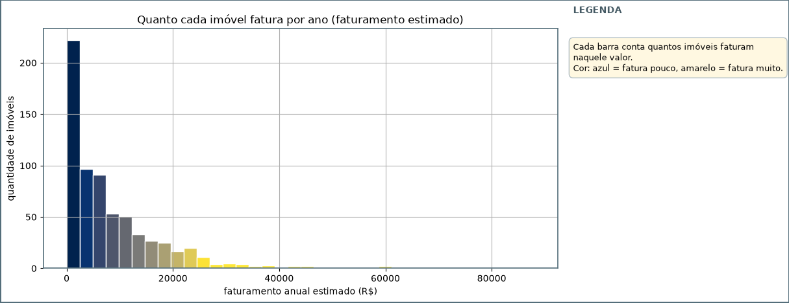
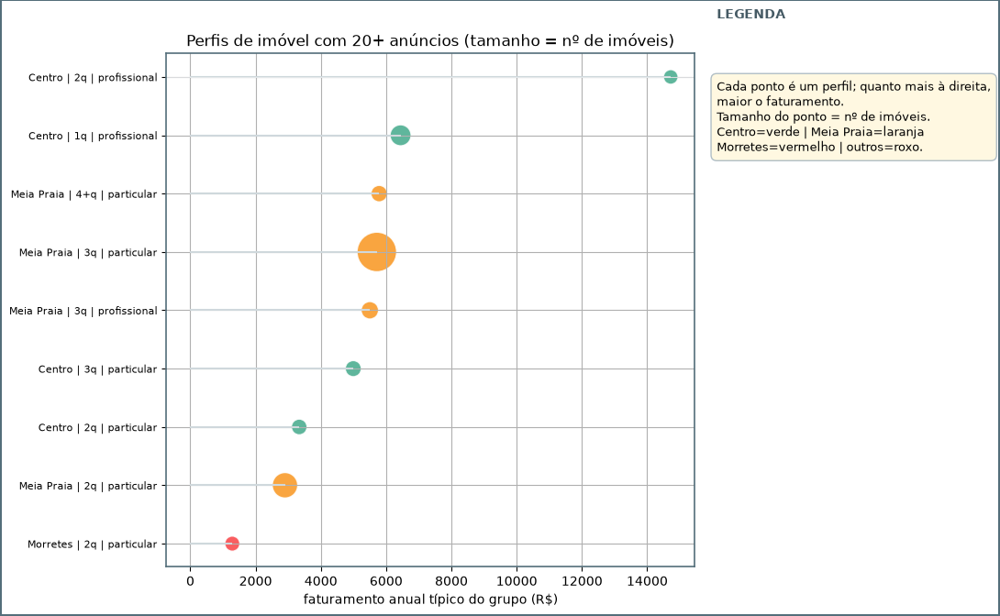
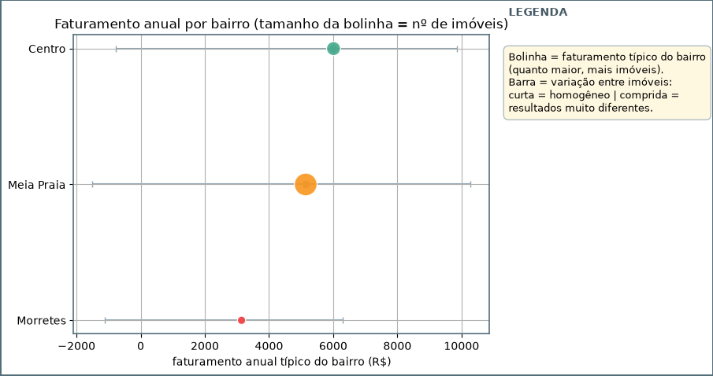
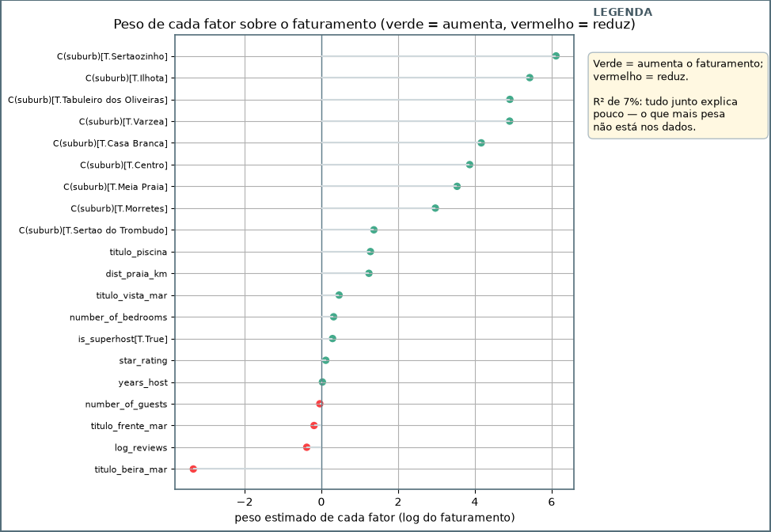
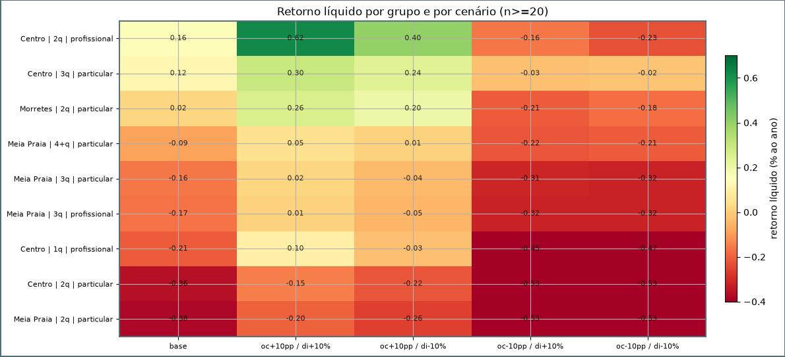

# Relatório de investimento em aluguel por temporada em Itapema (SC)

**Preparado para a Seazone · Hackathon Jovens Talentos AI Builder 2026**

Este relatório reúne o que aprendemos com os dados de Itapema e termina com uma recomendação de investimento. Ele foi escrito para qualquer pessoa conseguir acompanhar, mesmo sem conhecer os detalhes de planilhas ou de programação. Os gráficos usados aqui estão no caderno `analise.ipynb` e todos os números vêm dos arquivos da pasta `outputs/`.

Uma observação metodológica antes de começar. A análise trabalhou apenas com grupos de imóveis que reuniam **20 anúncios ou mais** com preço conhecido. Grupos menores que isso, mesmo quando mostram números altos, podem refletir um ou dois imóveis e por isso foram descartados. Todo número citado aqui pertence a um grupo que passou por esse filtro.

## O desafio e o que buscamos responder

A Seazone gerencia mais de três mil imóveis de aluguel por temporada no Brasil e precisa decidir onde e no que investir. Para a cidade de Itapema, no litoral de Santa Catarina, fomos perguntados quatro coisas:

1. Qual é o melhor perfil de imóvel para investir, considerando o tipo de imóvel, o número de quartos e quem administra o anúncio.
2. Qual é a melhor localização em termos de receita.
3. Quais características explicam as melhores receitas.
4. Se a Seazone fosse investir hoje, o que comprar e por quê, com uma estimativa simples de retorno.

Além disso, uma análise interna ainda não validada sugeria que **apartamentos compactos (studio e 1 quarto) na região do Centro** seriam a aposta mais eficiente. Este relatório posiciona essa tese com os dados.

Uma observação importante antes de tudo. A Seazone não compra os imóveis, ela opera imóveis de terceiros e ganha uma porcentagem de cada diária alugada. Por isso o critério de "melhor" aqui não é o lucro do dono de um único apartamento, mas o que gera mais **receita por unidade operada** e ainda abre espaço para a operação inteira funcionar com folga.

## Os dados que recebemos e como os ligamos

Recebemos cinco arquivos. Os três primeiros contam a história dentro do site do Airbnb: um cadastro dos anúncios (quantos quartos, avaliações, notas, tipo de imóvel), um cadastro dos anfitriões (há quanto tempo anunciam, se são superhost) e um arquivo que guarda o bairro e a coordenada de cada imóvel. Um quarto arquivo guarda o preço de cada noite de estadia. O quinto arquivo vem do site VivaReal e mostra o mercado de compra e venda: preço, preço por metro quadrado, condomínio e IPTU.

Cada imóvel do Airbnb tem um número de identificação que aparece em quase todas as planilhas. Ele é o fio que amarra o mesmo imóvel ao seu bairro, ao seu preço e às suas avaliações. O VivaReal usa outro sistema de código, então a comparação de preço de compra foi feita por bairro e por número de quartos.

Também é honesto dizer o que não temos. A coleta de preços foi feita em poucos dias de janeiro de 2025, e por isso observamos principalmente as noites de janeiro a abril, sem o mês de dezembro, que costuma ser o auge do verão catarinense. Não existe uma coluna que diga, noite por noite, se o imóvel estava ocupado ou livre. E só uma pequena parte dos anúncios tem preço.

## Como medimos a receita de cada imóvel

Como não temos a lista de noites ocupadas, usamos a pista que os próprios dados deixaram. Quando uma noite estava livre na primeira fotografia e sumiu nas fotografias seguintes, contamos como se aquela noite tivesse sido vendida. Já quando a noite aparecia ocupada logo na primeira fotografia, preferimos não contar como receita, para não exagerar os números.

Com isso calculamos, para cada imóvel, três coisas simples:

- a **ocupação**, ou seja, de cada dez noites do período, quantas viraram reserva;
- a **diária mediana**, que é o preço "do meio" praticado pelo imóvel;
- o **faturamento anual**, que parte do que vimos no período e escala para o ano inteiro, assumindo que esses quatro meses concentram 70% da receita de Itapema.

O gráfico abaixo mostra a distribuição do faturamento anual estimado. A maioria dos imóveis fatura pouco, e um punhado fatura muito.

Essa forma de medir receita tende a ser **conservadora**. A janela curta e a falta do mês de dezembro nos fazem enxergar menos do que a cidade realmente movimenta. Então, quando este relatório disser que um perfil fatura um valor, pense nele como um piso, não como um teto.

## Qual é o melhor perfil de imóvel

Para comparar, agrupamos os imóveis por bairro, tipo de imóvel, número de quartos e tipo de anúncio (profissional ou particular). Como dissemos no início, trabalhamos apenas com grupos que tivessem **20 imóveis ou mais** com preço conhecido.

O grupo que mais se destaca é o **apartamento de dois quartos com anúncio profissional no Centro**, com faturamento anual típico de cerca de R$ 14,7 mil. Ele aparece isolado no topo. Logo em seguida vem o um quarto profissional do Centro, com R$ 6,4 mil. Depois vêm os imóveis da Meia Praia e o Centro de três quartos particular, todos na casa dos R$ 5 mil a R$ 5,7 mil.

O gráfico de perfis no caderno mostra cada grupo como um ponto. Quanto mais à direita, maior o faturamento típico. O tamanho do ponto indica quantos imóveis aquele grupo reúne, e a cor diferencia os bairros.

Ou seja, olhando apenas para receita, o perfil mais forte é o **apartamento de dois quartos, gerenciado por um anfitrião profissional**. Os compactos de um quarto ficam no meio da tabela, e os imóveis da Meia Praia, mesmo tendo muito mais volume, rendem menos por unidade.

## Qual a melhor localização

Agrupamos a receita por bairro e observamos os bairros com amostra suficiente. O gráfico mostra, para cada um, o faturamento típico (a bolinha) e a variação entre os imóveis daquele bairro (a barra). Quanto maior a bolinha, mais imóveis aquele bairro contribuiu com dados.

O **Centro** tem o maior faturamento típico, cerca de R$ 6 mil por ano, com ocupação de 11%. A **Meia Praia** aparece logo atrás com R$ 5,1 mil e ocupação de 10%, mas reúne 431 imóveis observados, quase o triplo do Centro (163). Tanta oferta junto costuma significar concorrência forte e preço mais pressionado. O **Morretes** vem por último, com R$ 3,1 mil e ocupação de apenas 6%.

Uma observação que faz diferença. Quando comparamos imóveis iguais entre bairros, o Centro nem sempre ganha. O que faz o Centro vencer no agregado é o volume de imóveis bons que ele concentra, não uma vantagem em cada tipo de imóvel.

## O que explica as melhores receitas

Tentamos descobrir quais características do imóvel explicam o faturamento usando um modelo estatístico. Entraram na conta o bairro, o número de quartos, se o anfitrião é superhost, há quantos anos ele anuncia, o número de avaliações, a nota do imóvel, a capacidade de hóspedes, a distância até a praia e palavras como "frente mar", "vista mar" e "piscina" no título do anúncio.

O gráfico abaixo mostra quanto cada fator pesa. Verde significa que aumenta o faturamento, vermelho que reduz.

O resultado mais importante é que o modelo inteiro explica muito pouco. As informações que temos na planilha quase não preveem quem vai faturar mais. Os dois fatores que surgem com efeito estatístico são estranhos: anunciar "beira mar" parece reduzir o faturamento e morar mais longe da praia parece aumentar, dois sinais que contrariam o senso comum e, provavelmente, refletem alguns poucos imóveis e não uma regra de mercado.

A leitura honesta é esta. O que mais pesa no faturamento, como a qualidade da gestão, a precificação dia a dia e a reputação construída, não está nas planilhas que recebemos. Portanto as conclusões deste relatório se apoiam na receita observada, e não em fórmulas que tentam prever receita a partir das características.

## Quanto custa e em quanto tempo se paga

Montamos a conta de quem compra um imóvel para alugar por temporada, usando os preços de venda do VivaReal. O investimento soma o preço de venda, cerca de 5% de custos de compra (ITBI, escritura e registro) e R$ 60 mil de mobília e enxoval completo. Do faturamento bruto, descontamos a comissão do canal (15%), o custo de limpeza por reserva, o condomínio, o IPTU, a manutenção (5%) e a taxa de administração da operadora (20%).

O retorno bruto é a receita dividida pelo investimento, antes das despesas. O retorno líquido é o que sobra depois de pagar todas. Entre os grupos confiáveis, o melhor retorno líquido é o do **Centro dois quartos profissional**, com **0,16% ao ano**. O Centro três quartos particular aparece com 0,12%, e o Morretes dois quartos particular com 0,02%. Os grupos da Meia Praia têm retorno negativo, variando de -0,09% a -0,38%.

Uma observação importante. Todos esses números são um piso. A ocupação medida está na casa dos 10% e, em grupos menores, chega a 19%. Se a receita real for maior do que esse piso, o retorno acompanha na mesma proporção. O que importa aqui é a **ordem entre os grupos**, que se mantém nos testes da próxima seção.

## E se as premissas mudarem

Para testar se a decisão muda quando mexemos nas premissas, recalculamos o retorno com a ocupação dez pontos percentuais maior ou menor e com a diária dez por cento maior ou menor, nas quatro combinações possíveis. O mapa de calor abaixo mostra o resultado, com cada linha sendo um grupo de imóveis e cada coluna um cenário. Verde é melhor, vermelho é pior.

Mesmo no cenário mais otimista, com ocupação e diária maiores, o melhor retorno líquido entre os grupos confiáveis chega a **0,62% ao ano**, do Centro dois quartos profissional. Em todos os cenários, os mesmos cinco grupos continuam no topo da lista: Centro dois quartos profissional, Centro três quartos particular, Morretes dois quartos particular, Meia Praia quatro mais particular e Meia Praia três quartos particular. Eles trocam de posição entre si, mas nenhum grupo de fora entra no páreo. Isso indica que a recomendação não depende de uma premissa específica, e sim da qualidade relativa de cada perfil.

## A tese dos compactos no Centro

A análise interna que recebemos sugeria que estúdios e um quarto no Centro seriam a aposta mais eficiente. Testamos essa tese comparando esse grupo com os demais.

Entre os grupos confiáveis, o um quarto profissional no Centro fatura R$ 6,4 mil por ano e tem retorno líquido negativo (-0,21%). O dois quartos profissional no mesmo bairro fatura R$ 14,7 mil e tem retorno positivo (0,16%). Ou seja, um imóvel de um quarto gera menos da metade da receita de um imóvel de dois quartos no mesmo bairro.

Na questão de escala, o mercado de venda do Centro tem 92 unidades de dois quartos à venda, contra 25 unidades de um quarto. Para uma operadora que precisa de muitas unidades, o compacto é exatamente o perfil mais raro, não o mais abundante.

A posição deste relatório é clara. **Os dados não sustentam a tese dos compactos no Centro.** O perfil perde em receita por unidade e perde em retorno. O segmento mais forte, com folga, é o apartamento de dois quartos administrado por profissional.

## Recomendação final

Se a Seazone fosse investir em Itapema hoje, com base no que os dados mostram, o caminho seria **concentrar esforços em apartamentos de dois quartos operados profissionalmente no Centro**.

O argumento em poucas linhas. Esse perfil tem o maior faturamento por unidade (R$ 14,7 mil ao ano) e o melhor retorno líquido entre os grupos confiáveis (0,16% ao ano). Em todos os cenários de premissa, ele se mantém no topo. A tese dos compactos no Centro, que foi o ponto de partida, não se confirmou nos dados.

É obrigatório repetir a ressalva que acompanha toda esta análise. As receitas aqui são um piso, medido em uma janela curta sem o mês de dezembro. Antes de fechar uma compra, o próximo passo natural é validar a ocupação com dados de pelo menos um ano inteiro e, de preferência, com a disponibilidade real das unidades, que hoje não está nas planilhas. A leitura relativa entre bairros e perfis sobrevive a essa validação, mas os números absolutos de retorno certamente vão melhorar.

## Limitações e o que faríamos com mais tempo

Nenhuma análise honesta termina sem dizer o que não consegue ver. A amostra é pequena e enviesada para os imóveis mais ativos. A janela curta deixou o mês de dezembro de fora. A ocupação é uma inferência, não uma medida. E o modelo que tenta explicar receita explicou quase nada.

Com mais uma semana, começaríamos pela validação da ocupação com dados de disponibilidade reais, repetiríamos a estimativa de receita por um segundo método independente (por exemplo, pelo número de avaliações de hóspedes, que cobre um período mais longo) e, com esse retorno mais confiável, fecharíamos a conta de custo e retorno por prédio.

O objetivo deste relatório não foi achar uma única resposta certa, e sim construir uma decisão que se defende pelos dados, que reconhece o que não sabe e que deixa claro o que fazer a seguir.

*Acompanhamento: este relatório foi escrito com o apoio de uma IA (OpenCode). Todo número mencionado aqui está em `outputs/` e pode ser reproduzido pelos códigos em `src/`.*